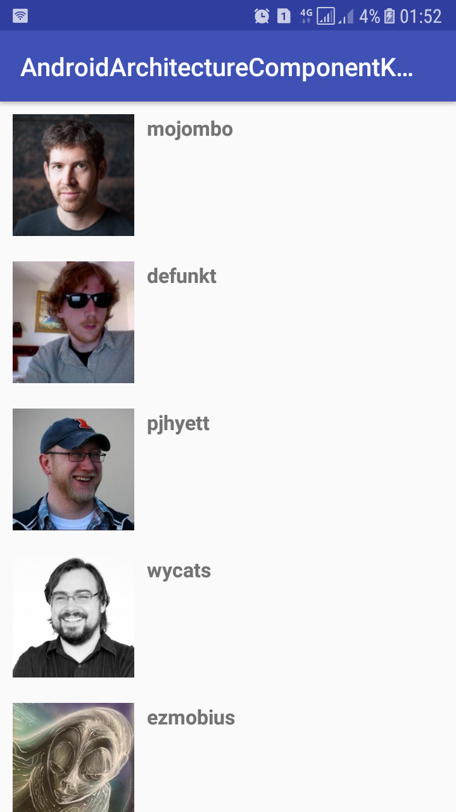

You can support me buy contributing code, filing bugs, asking/answering questions, or buying me a coffee.

<a href='https://ko-fi.com/alidouiri' target='_blank'>
  
</a>

# Android Architecture Components with Kotlin

In this example we're building a UI that shows a github users.


# Building the user interface

The UI will consist of a fragment UsersFragment.kt and its corresponding layout file fragment_users.xml.

We will create a UserViewModel.kt based on the ViewModel class to keep this information.

```
A ViewModel provides the data for a specific UI component, such as a fragment or activity, and handles the communication with the business part of data handling, such as calling other components to load the data or forwarding user modifications. The ViewModel does not know about the View and is not affected by configuration changes such as recreating an activity due to rotation.
```

Now we have 3 files.

fragment_users.xml: The UI definition for the screen.

UserViewModel.java: The class that prepares the data for the UI.

UsersFragment.java: The UI controller that displays the data in the ViewModel and reacts to user interactions.

Now, we have these three code modules, how do we connect them? After all, when the ViewModel's user field is set, we need a way to inform the UI. This is where the LiveData class comes in.

```
LiveData is an observable data holder. It lets the components in your app observe LiveData objects for changes without creating explicit and rigid dependency paths between them. LiveData also respects the lifecycle state of your app components (activities, fragments, services) and does the right thing to prevent object leaking so that your app does not consume more memory.
```

Every time the user data is updated, the onChanged callback will be invoked and the UI will be refreshed.

If you are familiar with other libraries where observable callbacks are used, you might have realized that we didn't have to override the fragment's onStop() method to stop observing the data. This is not necessary with LiveData because it is lifecycle aware, which means it will not invoke the callback unless the fragment is in an active state (received onStart() but did not receive onStop()). LiveData will also automatically remove the observer when the fragment receives onDestroy().

We also didn't do anything special to handle configuration changes (for example, user rotating the screen). The ViewModel is automatically restored when the configuration changes, so as soon as the new fragment comes to life, it will receive the same instance of ViewModel and the callback will be called instantly with the current data. This is the reason why ViewModels should not reference Views directly; they can outlive the View's lifecycle. [See The lifecycle of a ViewModel][7].

# Fetching data

Now we have connected the ViewModel to the fragment, but how does the ViewModel fetch the user data? In this example, we use a REST API of Github to retrieve the list of users. We will use the Retrofit library to access.

Here's our retrofit Webservice :

```kotlin

interface RemoteService {

    @GET("users")
    fun getUsersFromApi() : Observable<Response<List<UserResponse>>>
}

```

A naive implementation of the ViewModel could directly call the Webservice to fetch the data and assign it back to the user object. Even though it works, your app will be difficult to maintain as it grows. It gives too much responsibility to the ViewModel class which goes against the principle of separation of concerns that we've mentioned earlier. Additionally, the scope of a ViewModel is tied to an Activity or Fragment lifecycle, so losing all of the data when its lifecycle is finished is a bad user experience. Instead, our ViewModel will delegate this work to a new Repository module.

```
Repository modules are responsible for handling data operations. They provide a clean API to the rest of the app. They know where to get the data from and what API calls to make when data is updated. You can consider them as mediators between different data sources (persistent model, web service, cache, etc.)
```

```kotlin

class RepositoryDataSource constructor(private val remoteDataSource: RemoteDataSource) : Repository {

    private val data = MutableLiveData<List<UserEntity>>()

    override fun getUsersFromApi() : LiveData<User> {

        remoteDataSource.getUsersFromApi()
                .subscribeOn(Schedulers.io())
                .observeOn(AndroidSchedulers.mainThread())
                .subscribe({ result -> data.setValue(Transformation.toUsersEtities(result.body()!!)) },
                           { error -> Log.e(TAG, "{$error.message}") },
                           { Log.d(TAG, "completed") })

         return data;
    }

```

# Connecting ViewModel and the repository

Now we modify our UserViewModel to use the repository.

```kotlin

class UserViewModel : ViewModel() {

    @Inject
    lateinit var mRepositoryDataSource : RepositoryDataSource

    init {

        App.mAppComponent.inject(this)
    }

    fun getUsers() : LiveData<List<UserEntity>> = mRepositoryDataSource.getUsersFromApi()

}

```

# Persisting data

With the current implementation, we will need to fetch the data again from the network. This is not only a bad user experience, but also wasteful since it will use mobile data to re-fetch the same data. You could simply fix this by caching the web requests, but it creates new problems. What happens if the same user data shows up from another type of request (e.g., fetching a list of friends)? Then your app will possibly show inconsistent data, which is a confusing user experience at best. For instance, the same user's data may show up differently because the list-of-friends request and user request could be executed at different times. Your app needs to merge them to avoid showing inconsistent data.

The proper way to handle this is to use a persistent model. This is where the Room persistence library comes to the rescue.

```
Room is an object mapping library that provides local data persistence with minimal boilerplate code. At compile time, it validates each query against the schema, so that broken SQL queries result in compile time errors instead of runtime failures. Room abstracts away some of the underlying implementation details of working with raw SQL tables and queries. It also allows observing changes to the database data (including collections and join queries), exposing such changes via LiveData objects. In addition, it explicitly defines thread constraints that address common issues such as accessing storage on the main thread.
```

To use Room, we need to define our local schema. First, annotate the User class with @Entity to mark it as a table in your database.

```kotlin

@Entity(tableName = "users")
data class UserEntity(

        @PrimaryKey(autoGenerate = true)
         var id     : Long = 0,
         var name   : String,
         var avatar : String
)

```

Then, create a database class by extending RoomDatabase for your app:

```kotlin

@Singleton
@Database(entities = arrayOf(UserEntity::class), version = 1)
abstract class LocalDataSource : RoomDatabase() {}

```

Notice that LocalDataSource is abstract. Room automatically provides an implementation of it. See the [Room][8] documentation for details.

Now we need a way to get, insert  and delete the users data into the database. For this, we'll create a data access object (DAO).

```kotlin

@Dao
interface UserDao {

    @Query("SELECT * FROM users")
    fun getUsers() : LiveData<List<UserEntity>>

    @Insert(onConflict = OnConflictStrategy.REPLACE)
    fun saveUsers(users : List<UserEntity>)

    @Query("DELETE FROM users")
    fun deleteUsers()
}

```

Then, reference the DAO from our database class.


```kotlin

@Singleton
@Database(entities = arrayOf(UserEntity::class), version = 1)
abstract class LocalDataSource : RoomDatabase() {

    abstract fun getUserDao() : UserDao

}

```

Notice that the load method returns a LiveData<User>. Room knows when the database is modified and it will automatically notify all active observers when the data changes. Because it is using LiveData, this will be efficient because it will update the data only if there is at least one active observer.

Now we can modify our RepositoryDataSource to incorporate the Room data source.

```kotlin

class RepositoryDataSource constructor(private val remoteDataSource: RemoteDataSource,
                                       private val roomDataSource: LocalDataSource) : Repository {

    /**
     * Get users from database
     */
    override fun getUsersFromDb(): LiveData<List<UserEntity>> = roomDataSource.getUserDao().getUsers()

    /**
     * Get users from api
     */
    override fun getUsersFromApi() : LiveData<User> {

            remoteDataSource.getUsersFromApi()
                    .subscribeOn(Schedulers.io())
                    .observeOn(AndroidSchedulers.mainThread())
                    .subscribe({ result -> data.setValue(Transformation.toUsersEtities(result.body()!!)) },
                               { error -> Log.e(TAG, "{$error.message}") },
                               { Log.d(TAG, "completed") })

             return data;
        }

    /**
     * Save users into database
     */
    override fun saveUsers(users: List<UserEntity>) {

        roomDataSource.getUserDao().saveUsers(users)
    }

    /**
     * Delete all users
     */
    override fun deleteUsers() {

        roomDataSource.getUserDao().deleteUsers()
    }
}

```

Tools used on the sample project
------------------------------------
* [Kotlin][6]
* [Android Architecture Components][1]
* [RxJava & RxAndroid][2]
* [Dagger 2][3]
* [Retrofit][4]
* [OkHttp][5]

[1]: https://developer.android.com/topic/libraries/architecture/adding-components.html
[2]: https://github.com/ReactiveX/RxAndroid
[3]: https://github.com/google/dagger
[4]: https://github.com/square/retrofit
[5]: https://github.com/square/okhttp
[6]: https://kotlinlang.org/
[7]: https://developer.android.com/topic/libraries/architecture/viewmodel#the_lifecycle_of_a_viewmodel
[8]: https://developer.android.com/topic/libraries/architecture/room


# Demo



### Resources to start with Kotlin on Android

* [Getting started with Android and Kotlin by Jetbrains][9]
* [Get Started with Kotlin on Android by Google][10]
* [Kotlin Lang Reference][11]
* [Kotlin Blog by Jetbrains][12]
* [Kotlin Kapt Annotation processing][13]
* [Kotlin for Android Developers by Antonio Leiva][14]

[9]: https://kotlinlang.org/docs/tutorials/kotlin-android.html
[10]: https://developer.android.com/kotlin/get-started.html
[11]: https://kotlinlang.org/docs/reference/
[12]: https://blog.jetbrains.com/kotlin/
[13]: https://kotlinlang.org/docs/reference/kapt.html
[14]: https://antonioleiva.com/kotlin-android-developers-book/


### Resources to start with Android Architecture Components 

* [Android Architecture Components][15]
* [Adding Components to your Project][16]
* [Android Architecture Components Samples][17]
* [Android Architecture Components CodeLabs][18]
* [Android Conferences - Google I/O 2017][19]

[15]: https://developer.android.com/topic/libraries/architecture/index.html
[16]: https://developer.android.com/topic/libraries/architecture/adding-components.html
[17]: https://github.com/googlesamples/android-architecture-components
[18]: https://codelabs.developers.google.com/?cat=Android
[19]: https://www.youtube.com/results?search_query=google+I%2FO+android+components

Developed By
------------

* Ali DOUIRI  - <my.alidouiri@gmail.com>

License
-------

MIT License

Copyright (c) 2018 Ali DOUIRI

Permission is hereby granted, free of charge, to any person obtaining a copy
of this software and associated documentation files (the "Software"), to deal
in the Software without restriction, including without limitation the rights
to use, copy, modify, merge, publish, distribute, sublicense, and/or sell
copies of the Software, and to permit persons to whom the Software is
furnished to do so, subject to the following conditions:

The above copyright notice and this permission notice shall be included in all
copies or substantial portions of the Software.

THE SOFTWARE IS PROVIDED "AS IS", WITHOUT WARRANTY OF ANY KIND, EXPRESS OR
IMPLIED, INCLUDING BUT NOT LIMITED TO THE WARRANTIES OF MERCHANTABILITY,
FITNESS FOR A PARTICULAR PURPOSE AND NONINFRINGEMENT. IN NO EVENT SHALL THE
AUTHORS OR COPYRIGHT HOLDERS BE LIABLE FOR ANY CLAIM, DAMAGES OR OTHER
LIABILITY, WHETHER IN AN ACTION OF CONTRACT, TORT OR OTHERWISE, ARISING FROM,
OUT OF OR IN CONNECTION WITH THE SOFTWARE OR THE USE OR OTHER DEALINGS IN THE
SOFTWARE.


