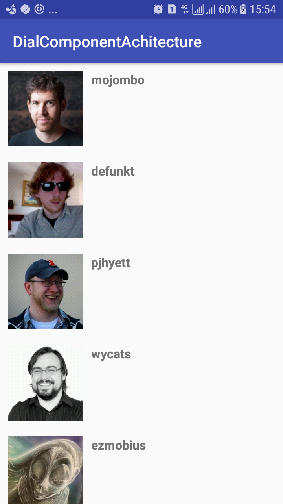

# Android Architecture Components with Kotlin

Android Sample : **Show users Github** used to practice Kotlin and Android Architecture Components.

# Android Achitecture Component

Tools used on the sample project
------------------------------------
* [Kotlin][6]
* [Android Architecture Components][1]
* [RxJava & RxAndroid][2]
* [Dagger 2][3]
* [Retrofit][4]
* [OkHttp][5]

[1]: https://developer.android.com/topic/libraries/architecture/adding-components.html
[2]: https://github.com/ReactiveX/RxAndroid
[3]: https://github.com/google/dagger
[4]: https://github.com/square/retrofit
[5]: https://github.com/square/okhttp
[6]: https://kotlinlang.org/

# Demo

### Resources to start with Kotlin on Android

* [Getting started with Android and Kotlin by Jetbrains][7]
* [Get Started with Kotlin on Android by Google][8]
* [Kotlin Lang Reference][9]
* [Kotlin Blog by Jetbrains][10]
* [Kotlin Kapt Annotation processing][11]
* [Kotlin for Android Developers by Antonio Leiva][12]

 [7]: https://kotlinlang.org/docs/tutorials/kotlin-android.html
[8]: https://developer.android.com/kotlin/get-started.html
[9]: https://kotlinlang.org/docs/reference/
[10]: https://blog.jetbrains.com/kotlin/
[11]: https://kotlinlang.org/docs/reference/kapt.html
[12]: https://antonioleiva.com/kotlin-android-developers-book/

### Resources to start with Android Architecture Components 

* [Android Architecture Components][13]
* [Adding Components to your Project][14]
* [Android Architecture Components Samples][15]
* [Android Architecture Components CodeLabs][16]
* [Android Conferences - Google I/O 2017][17]

[13]: https://developer.android.com/topic/libraries/architecture/index.html
[14]: https://developer.android.com/topic/libraries/architecture/adding-components.html
[15]: https://github.com/googlesamples/android-architecture-components
[16]: https://codelabs.developers.google.com/?cat=Android
[17]: https://www.youtube.com/results?search_query=google+I%2FO+android+components

Developed By
------------

* Ali DOUIRI  - <my.alidouiri@gmail.com>

License
-------

    Copyright 2018

